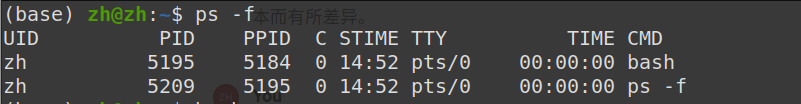
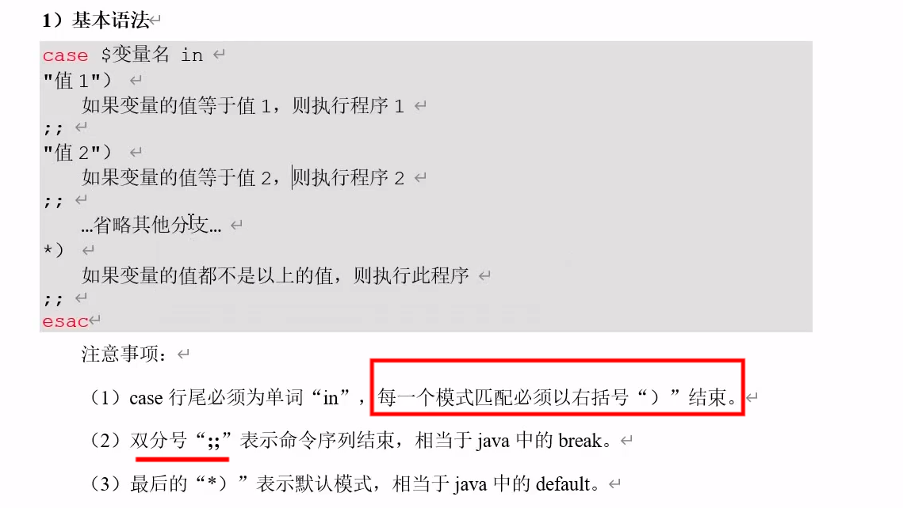
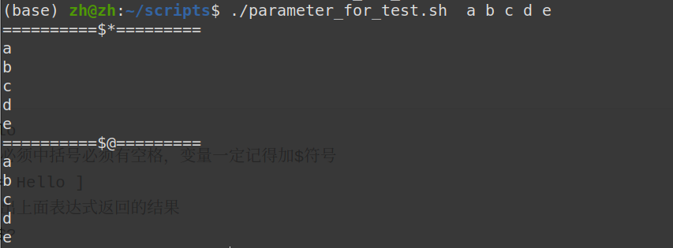
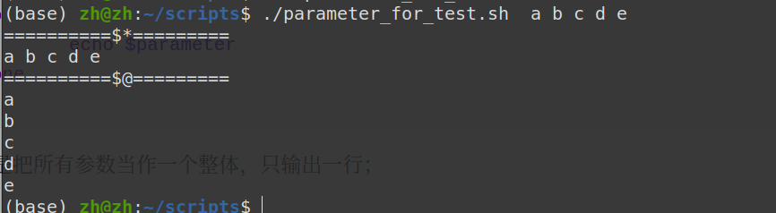

# Linux shell

### 1执行第一个脚本

一个控制台就是一个bash;

一行内容输入两个命令，用；隔开就行；

查看当前所有的shell解释器

```bash
cat /etc/shells
```

查看系统默认解释器

```
echo $SHELL
```

脚本格式

```
#!/bin/bash 第一行，指定解释器，没有空格
```

编完脚本之后，脚本没有执行权限的执行方式

```
bash ./hello.sh（在当前文件目录，或者主目录都可以；也可以使用绝对路径）
```

赋予脚本执行权限，再执行

```
chmod +x ./hello.sh
./hello.sh
或者
. hello.sh， 是有个空格的
```

执行脚本

```
相对路径方式： ./hello.sh,这种是新建一个bash，然后执行这个脚本；
source : source hello.sh;这是直接在当前bash里，执行脚本

```


### 2.变量

##### 2.1分类：两种方式

* 全局变量和局部变量
* 系统变量和用户变量
* 局部变量：只对子shell内部有效；
* 系统变量:都是$加大写字母
* 系统变量基本都是全局变量

##### 2.2常用命令

* 查看当前所有的全局环境变量

* ```
  env
  使用less查看器看：env | less
  ```

* 查看所有变量:系统自定义的和用户定义的都有

* ```
  set
  set | less
  ```

* 查看指定的变量

* ```
  set | grep my_var 
  ```

##### 2.3父子shell之间的关系

* bash里面输入一个bash，可以进入子bash，此时输入exit退出的只是子shell，而不是外面的父shell;
* 子shell里面修改变量的值，父shell这个值不会更改
* ...还有许多关系，尚硅谷的这部分有机会再看

```
$HOME, $USER

查看指定的系统变量内容：
echo $HOME

查看所有环境变量
env | less
要退出 "less" 查看器，您可以按 "q" 键。这将关闭 "less" 并返回到命令行提示符。

$+变量名，就可以随时随地使用这个变量，就相当于用他的值
```

##### 2.4自定义变量

* 变量名+等于号+变量值

* **变量在赋值的时候，不加dollar符；但是在其他地方用的时候，需要加dollar符；**

* **a=2(赋值时等号两边不能加空格)**

* 默认创建的是局部变量：进入一个子bash，就打印不出刚定义的变量了;

  * 定义全局变量：在定义完变量的基础上，输入export  my_var; （注意这里不需要加dollar符
  * 这个全局变量的范围是指，这个bash和他的子bash都可以看见这个全局变量，这个bash的父bash依然不能看见这个变量，自定义的bash只对自己的子bash有效
  * 全局变量，在一个子bash中修改，退出这个bash之后，外面的这个变量的值不会受到影响。

* 学习一个命令

  ```
  ps -f
  ps命令用于显示当前运行的进程的信息。ps -f是ps命令的一个选项，用于显示完整的进程信息。
  PID（进程ID）： 进程的唯一标识符。
  父进程（PPID）；
  ```

  

  这个输出显示了由用户“zh”启动的两个进程，一个是bash shell，另一个是执行 `ps -f` 命令的进程

* 使用变量的时候不要忘记美元符号

  ```bash
  a=2
  echo $a
  my_var='hello, world'
  ```

* 定义只读变量

  ```
  readonly b=5
  ```

* 删除变量

  ```
  # 删除变量a,这里也不需要加dollar符
  unset a
  ```

  * 只读变量不能unset

* 直接输入脚本名，运行命令

  * 需要把文件复制到/bin/目录下面，但是/bin/目录下，都是系统文件，最好不要改它里面的问题；

  * 另一个方法，向系统里增加环境变量。

    ```
    echo $PATH
    这个输出结果是增加的所有路径，直接运行命令时，系统会在这些目录下找对应的文件，看是否能找到。
    ```

  * 只要把脚本所在的文件目录，添加到PATH环境变量中，就可以直接执行脚本名

* 特殊变量：为了处理脚本的参数

  * $n: n替换成数字，代表第几个参数，两位数字及以上需要用大括号括起来

    ```
    $1, $2, ${14}
    ```

    其中$0指脚本名称。

  * ```bash
    编写一个脚本 hello.sh
    #! /bin/bash
    echo "hello, world"
    echo "hello, $1"
    注意用双引号，单引号不行。
    运行时：./hello.sh xiaoming 即可
    ```

  * 注意：注意用双引号，双引号会将$开头的认为是变量符；单引号括起来的内容会原封不动地打印出来

  * 样例2：parameter.sh

    ```bash
    #!/bin/bash
    echo '========$n========'
    echo "script name: $0"
    echo "first parameter: $1"
    echo "second paramater: $2"
    
    ```

    ```bash
    ./parameter.sh abc def
    
    输出：
    ========$n========
    script name: ./parameter.sh
    first parameter: abc
    second paramater: def
    ```

    

  * $#:获取输入参数的个数，常用于循环，以及判断输入参数是否正确。更改parameter.sh:

    ```bash
    #!/bin/bash
    echo '========$n========'
    echo "script name: $0"
    echo "first parameter: $1"
    echo "second paramater: $2"
    echo '========$#========'
    echo "parater number: $#"
    ```

    输出：

    ```bash
    ========$n========
    script name: ./parameter.sh
    first parameter: abc
    second paramater: def
    ========$#========
    parater number: 2
    ```

* $*： 代表命令行中所有参数，将这些参数看作一个整体

* $@：代表命令行中所有参数，将这些参数区分对待

  ```bash
  #!/bin/bash
  echo '========$n========'
  echo "script name: $0"
  echo "first parameter: $1"
  echo "second paramater: $2"
  echo '========$#========'
  echo "parater number: $#"
  echo '========$*========'
  echo "$*"
  echo '========$@========'
  echo "$@"
  ```

  运行：./parameter.sh abc def

  输出结果：

  ```bash
  ========$n========
  script name: ./parameter.sh
  first parameter: abc
  second paramater: def
  ========$#========
  parater number: 2#! /bin/bash
  ========$n========
  script name: ./parameter.sh
  first parameter: abc
  second paramater: def
  ========$#========
  parater number: 2
  ========$*========
  abc def
  ========$@========
  abc def
  ```

* $? :是一个特殊的变量，它用于获取上一个执行的命令的退出状态码（或称为返回码）。每个在 shell 中执行的命令都会在执行完毕后返回一个退出状态码，这个状态码是一个整数，通常用于指示命令的执行结果。具体来说，`$?` 保存了上一个命令的退出状态码。一般来说，0 表示成功，而其他非零值表示出现了错误。

  ```
  正常执行脚本之后，输入$?会返回0；
  如果执行一个没有的命令（比如直接输入一个脚本的名称），会报错未找到命令；这时再输入$?，会返回 127
  ```

### 3运算符

* ```
  a=1+2 # echo $a 的值是1+2,当作了字符串
  ```

* $ + 双小括号或者中括号，里面是表达式:

  * **等号左右两边不允许有空格**，否则会被当成命令

  ```bash
  a=$((6+8))
  或者
  a=$[6+8]
  ```

  * 在脚本中，变量替换是$(某一个变量)；表示式是双小括号或者中括号

  ```bash
  # 在脚本中，想要的当前时间戳
  fliename="$1"+log_$(date +%s)
  ```

  

* 实现一个加法脚本add.sh

  ```bash
  #!/bin/bash
  sum=$[$1 + $2]
  echo sum=$sum
  ```

  执行：赋予可执行权限：

  ```bash
  chmod +x ./add.sh
  ./add.sh 13 12
  ```


### 4.条件判断

* 一些理解：

  * 对于一些有空格的地方如何理解？就是参数，把空格隔开的内容就看作是参数
  * **给变量赋值的时候，等号不能有空格；判断表达式的时候，必须有空格**


* linux中0为真，1为假（其实这样理解不太准确）

* 表达式里面等号一定和要比较的两个变量中间有空格，否则bash就会把他们认为一体，从而一直判断正确

* test+表达式

  * ```bash
    a=hello
    test $a = hello
    echo $?  
    # 输出的应该是0，表示表达式成立
    ```

  * ```bash
    a=hello
    test $a = Hello
    echo $?  
    ```

* 中括号：[ 表达式 ], 表达式一定要和中括号中间有空格。

  * ```bash
    [ $a = hello ]
    echo $?
    ```

  * ```bash
    [ dsedwedwe ]
    echo $?
    # 输出的就是0，随便一个字符串输出的就是0
    
    [        ]
    echo $?
    # 中括号里面什么都没有，才是输出1
    ```

  * 判断不等于

    ```bash
    [ $a != hello ] 
    ```

  * 数值判断等于、不等于、大于、小于

    ```
    =
    !=
    ```

    中括号的表达式里面大于小于的符号需要用下面的符号表示，因为 <   > 在linux里面有别的含义;

    双小括号里面：可以直接用数学的符号：小于等于：<=,以此类推

    | 符号 | 含义          |          |
    | ---- | ------------- | -------- |
    | -eq  | equal         | 等于     |
    | -ne  | not equal     | 不等于   |
    | -lt  | less than     | 小于     |
    | -le  | less equal    | 小于等于 |
    | -gt  | greater than  | 大于     |
    | -ge  | greater equal | 大于等于 |

  * 判断字符串

  * ```bash
    a=hello
    # 注意必须中括号必须有空格，变量一定记得加$符号
    [ $a = Hello ]
    # 打印出上面表达式返回的结果
    echo $?
    # 结果应该是0，表示为真
    
    # 判断是否不等于1
    [ $a != Hello]
    
    ```

* 判断文件权限


  * 

  * | 符号 | 含义    |          |
    | ---- | ------- | -------- |
    | -r   | read    | 读权限   |
    | -w   | write   | 写权限   |
    | -x   | execute | 执行权限 |

  * ```bash
    [ -r hello.sh ]
    echo $?
    ```

* 判断文件类型


  * 

  * | 符号 | 含义      |                      |
    | ---- | --------- | -------------------- |
    | -e   | existence | 文件存在             |
    | -f   | file      | 文件存在且是常规文件 |
    | -d   | directory | 文件存在且是目录     |

  * ```bash
    [ -e ./hello.sh ]
    ```

* 多条件判断


  * $$ 上一条命令为真时，才执行后面一条命令

  * || 上一条命令为假时，才执行后面一条命名

  * 实现java里的三元运算符

    ```bash
    [ a -lt 20] && echo "a < 20" || echo "a >= 20"
    ```


### 5.流程控制

* if

  * 单分支

    ```bash
    if [ 条件判断式 ];then
    	程序
    fi
    ```

  * ```bash
    if [ 条件判断式 ];
    then
    	程序
    fi
    ```

  * 多个表达式时：

    ```bash
    if [ $a -gt 18 ] && [ $a -lt 35 ]; then echo OK; fi
    ```

    如果非要写到一个中括号里，用-a(and) -o(or) 连接

    ```
    if [ $a -gt 18 -a $a -lt 35 ]; then echo OK; fi
    ```

  * 双分支：表达式后面没有了;（分号）

    编写一个判断是否成年的脚本：if_test.sh

    ```bash
    if [ 表达式 ]
    then
            程序
    else
            程序
    fi
    ```

    ```bash
    #!/bin/bash
    if [ $1 -lt 18 ]
    then
            echo "未成年"
    else
            echo "已成年"
    fi
    ```

  * 多分支

    ```bash
    if [ 表达式 ]
    then
            程序
    elif [ 表达式 ]
    then
            程序
    else [ 表达式 ]    
    		程序
    fi
    ```

    编写一个判断是否年龄段的脚本：if_test.sh

    ```bash
    #!/bin/bash
    if [ $1 -lt 18 ]
    then
            echo "未成年"
    elif [ $1 -lt 35 ]
    then
            echo "青年人"
    elif [ $1 -肃穆lt 60 ]
    then
            echo "中年人"
    else
            echo "老年人"
    fi
    ```

* case

  

  建立一个case_test.sh脚本

  ```bash
  #!/bin/bash
  
  case $1 in
  1)      
          echo "one"
  ;;      
  2)
          echo "two"
  ;;      
  3)
          echo "three"
  ;;      
  *)
          echo "number else"
  esac
  ```

* for循环

  * 基本语法1

    ```
    for (( 初始值;循环控制条件;变量变化))
    do
    	程序
    done
    ```

    写一个1加到输入参数的sum_to.sh脚本

    ```bash
    #!/bin/bash
    
    for (( i=1; i <= $1; i++ ))
    do
            sum=$[ $sum + $i ]
    #		sum=$(( $sum + $i ))
    done
    echo $sum
    
    ```

    上面有几个需要注意的点：

    ​	表达式外面有一个dollar符，不管是双小括号还是中括号；

    ​	变量和别人相加时，需要加dollar符；

    ​	作为运算表达式时，双小括号还是中括号不必和里面的内容隔开
    
  * 更常用的语法格式
  
    ```bash
    for 变量 in 值1 值2 值3...
    do
    	程序
    done
    ```
  
    ```bash
    for os in linux windows macos; do echo $os; done
    ```
  
    打印1到10的序列
  
    ```bash
    echo {1..10}
    ```
  
    从1加到100
  
    ```bash
    for i in {1..100}; do sum=$[ $sum + $i ];done; echo $sum
    ```
  
    区分dollar*  dollar@:文件parameter_for_test.sh
  
    ```bash
    #!/bin/bash
    
    echo '==========$*========='
    for parameter in $*
    do
            echo $parameter
    done
    
    echo '==========$@========='
    for parameter in $@
    do
            echo $parameter
    done
    ```
  
    当都没有被引号括起来的时候，两者一样。
  
    
  
    修改一下：将dollar*  dollar@用双引号括起来
  
    ```bash
    #!/bin/bash
    
    echo '==========$*========='
    for parameter in "$*"
    do
            echo $parameter
    done
    
    echo '==========$@========='
    for parameter in "$@"
    do
            echo $parameter
    done
    
    ```
  
    发现 $*是把所有参数当作一个整体，只输出一行；
  
    

* while循环；自己看


### 6.读取控制台输入

* read;

  选项：

  -p:指定提示符

  -t:指定读取值时的等待时间，如果不加-t代表一直等待

  参数：

  变量：指定读取值时的变量名

  例子：read_test.sh

  ```bash
  #!/bin/bash
  
  read -t 10 -p "请输入你的名字：" name
  echo "welcome, $name"
  
  ```

### 7.函数

​	和脚本不同，脚本一般没有返回值，而且函数比脚本更加灵活。

* 系统函数

  比如 date，如何使用系统函数的返回值 $(系统函数)
  
  在脚本中，变量替换是$(某一个变量)；表示式是双小括号或者中括号
  
  ```bash
  # 在脚本中，想要的当前时间戳
  fliename="$1"+log_$(date +%s)
  ```
  
  basename：basename [pathname]  [可选的suffix]:basename会删掉字符串的所有前缀包括最后一个'/'字符，然后将字符串显示出来；**可以理解为取路径里的文件名称**。
  
  ```bash
  # linux.txt
  basename /home/zh/linux.txt
  
  # linux
  basename /home/zh/linux.txt .txt
  ```
  
  在这个例子中，（样例2：parameter.sh），采用相对路径和绝对路径执行parameter.sh脚本时$0的值不一样，因为他会把所有脚本的路径都带着。
  
  ```bash
  #!/bin/bash
  echo '========$n========'
  echo "script name: $0"
  echo "first parameter: $1"
  echo "second paramater: $2"
  ```
  
  ```bash
  # 相对路径执行
  ./parameter.sh abc def
  
  # 输出：
  ========$n========
  script name: ./parameter.sh
  first parameter: abc
  second paramater: def
  
  # 绝对路径执行
  /home/zh/scripts/parameter.sh a b
  
  # 输出：
  script name: /home/zh/scripts/parameter.sh
  first parameter: a
  second paramater: b
  ```
  
  修改parameter.sh让脚本名称只显示脚本名
  
  ```bash
  #!/bin/bash
  echo '========$n========'
  
  # 注意使用系统函数之后，使用他的返回值需要 $( )
  echo "script name: $(basename $0 .sh)"
  
  echo "first parameter: $1"
  echo "second paramater: $2"
  echo
  ```
  
  ```bash
  # 绝对路径执行
  /home/zh/scripts/parameter.sh a b
  
  # 输出：
  script name:parameter
  first parameter: a
  second paramater: b
  ```
  
  dirname:把输入的字符串最后一个/及其以前的内容剪切下来，相当于使用绝对路径时，把文件删除，得到该文件的路径
  
  ```bash
  dirname /home/zh/scripts/Hello.txt
  
  # /home/zh/scripts
  ```
  
  实现parameter.sh，将当前函数的绝对路径打印出来（不管是使用绝对路径还是相对路径调用的这个函数
  
  ```bash
  #!/bin/bash
  echo '========$n========'
  # 注意使用系统函数之后，使用他的返回值需要 $( )
  echo "script name: $(basename $0 .sh)"
  
  # 得到脚本的绝对路径
  
  # 先把脚本所在的工作目录剪切出来：如果是绝对路径，那就是脚本所在的绝对路径；如果是相对路径，剪出来的可能是./这样，那就用pwd把当前所在路径的绝对路径打印出来
  cd $(dirname $0)
  echo "script path: $(pwd)"
  
  
  echo "first parameter: $1"
  echo "second paramater: $2"
  ```
  
  ```bash
  ./parameter.sh a b
  
  script name: parameter
  script path: /home/zh/scripts
  first parameter: a
  second paramater: b
  
  ```
  
  

### 8.综合应用

样例：实现一个每天对指定目录归档备份的脚本:daily_archive.sh。输入一个目录名称（末尾不带/），将目录下的所有文件按天归档保存，并将归档日期附加在归档文件名上，放在/home/zh/archive下。

```bash
#!/bin/bash

# 首先判断输入参数个数是否为1
if [ $# -ne 1 ]
then
        echo "参数个数错误！应输入一个参数，作为归档目录名"
        exit
fi

# 从输入参数获取目录名称，判断是不是一个存在的目录
if [ -d $1 ]
then
        echo
else
# 这里的第一个echo起到换行的作用
        echo
        echo "目录不存在"
        exit
fi

# 截取文件路径
DIR_NAME=$(basename $1)
DIR_PATH=$(cd $(dirname $1); pwd)

# 获取当前日期
DATE=$(date +%y%m%d)

# 定义生成的归档文件名称
FILE=archive_${DIR_NAME}_$DATE.tar.gz

# 定义生成的路径
DEST=/home/zh/模板/$FILE

# 开始归档目录文件

echo "开始归档..."
echo

tar -czf $DEST $DIR_PATH/$DIR_NAME
if [ $? -eq 0 ]
then
        echo 
        echo "归档成功"
        echo "归档文件为：$DEST"
        echo
else
        echo "归档出现问题"
        echo
fi
exit

```

执行结果：

```bash
./daily_archive.sh ../scripts

结果：
开始归档...

tar: 从成员名中删除开头的“/”

归档成功
归档文件为：/home/zh/模板/archive_scripts_231217.tar.gz
```

### 9.文本处理工具

* cut [参数] filename

  ```bash
  -f	提取第几列
  -d 	指定分割符，默认是'\t'；可以改成冒号，空格等
  -c	按字符进行切割，后加n表示取第几列
  ```

  cut.txt文件：

  ```bash
  ZJU	HangZhou
  I'm	I'll
  Coming	come
  
  ```

  ```
  cut  -f 2 cut.txt
  HangZhou
  I'll
  come
  ```

  ```bash
  cut -d ' '  -f 2 cut.txt
  
  # 第2，3列
  cut -d ' '  -f 2,3 cut.txt
  
  # 第3列以后的所有列
  cut -d ' '  -f 3- cut.txt
  
  # 第2到4了
  echo $PATH | cut -d ':'  -f 2-4 
  ```

  
