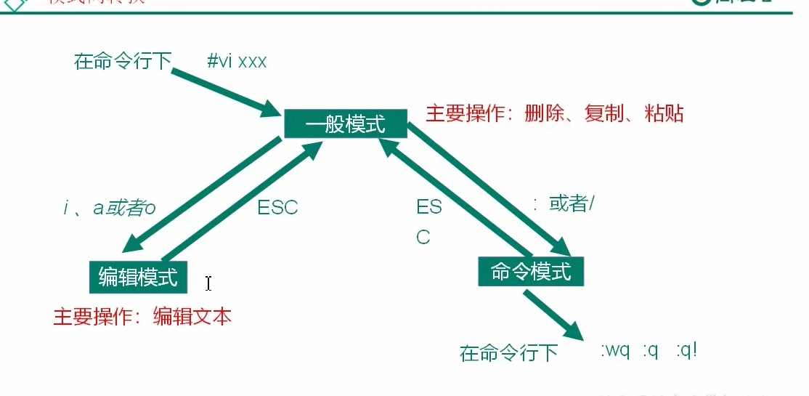

# linux_vim

### 1.三种模式

* 一般模式：直接进入的那个模式,删除复制粘贴
* 编辑模式：一般模式按i , a, o;
* 命令模式：保存(w), 退出（q）

### 2.转换：



### 3.一般模式

**如果光标是竖杠，就是竖杠之后的所有内容；如果光标是方格，就是方格及其后面的内容。**

* yy:复制光标所在行;

* 8yy:复制光标所在行开始的8行

* p:在光标的下一行将复制的内容粘贴

* 4p:在光标的下一行将复制的内容粘贴4次

* dd:删除当前行

* 3dd:删除当前行开始的3行

* u：撤销一次操作

* y$:从当前光标位置复制到这一行结尾

* y^:从当前光标位置复制到这一行开始

* ```
  linux中$代表结尾，^代表开始
  ```

* w:按照单词跳；

* yw:复制当前单词

* dw:删除当前词，应该首先移动到当前单词的开头

* d$:删除光标位置之后的内容

* x:剪切，会删除当前字符

* X:就相当于windows下面的退格。

* ^:移动到当前行行首

* $:移动到当前行行尾

* gg:跳转到文章开头

* G或者L:跳到文章的最后一行行首

* 3G:跳转到第三行行首

* 显示行号：先从一般模式转到命令模式，按:然后输入 set nu ,再回车，就可以显示行号；然后可以看想跳的内容，知道了行号，就可以 17G，跳到17行

### 4.编辑模式

* 输入i,a,o进入编辑模式；
* 按Esc退出编辑模式
* i:进入编辑模式,在当前光标前
* a:进入编辑模式,在当前光标后面
* o:进入编辑模式,在当前光标的下一行编辑

### 5.命令模式

* 一般模式 按 : 或者 \进入命令行

* 

* | 命令 | 功能             |
  | ---- | ---------------- |
  | :w   | 保存             |
  | :q   | 退出             |
  | :wq  | 保存并退出       |
  | :q   | 不保存，强制退出 |

* 显示行号： set nu 