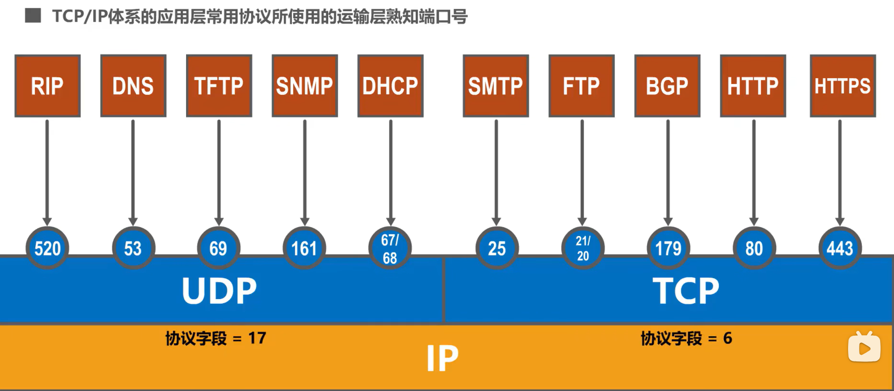

# 计算

## 一、第一章：计算机网络和因特网

### 1.什么是因特网

* 因特网是一个计算机网络。第一个计算机网络的诞生，APAR net 具有四个结点
* 计算机网络的两大功能：**数据通信、资源共享。**
* 什么是计算机网络：将分散的、具有独立功能的计算机系统、通信设备和线路连接起来，实现数据通信和资源共享的系统。用通信设备和链路连接起来，使用网络协议进行数据通信和资源共享的计算机集合。
* 因特网提供的服务：
  * **面向连接的可靠服务**：通信前后需要建立和拆除连接（逻辑连接），保证数据按序完整正确地交给对方。如传输层的TCP（*Transmission Control Protocol*）协议。
  * **无连接的不可靠服务**：无连接，不对交付质量作保证，效率高。如传输层的UDP协议
  * 通常，一种网络应用只使用一种服务。如邮件传输(面向连接)、简单文件传输(无连接)
* 计算机网络的分类：
  * 按照分布范围：
    * 广域网（WAN)、城域网（MAN）、局域网（LAN）、个域网（PAN）
  * 按拓扑结构分：
    * 总线型、星型、环形、网状型
* 网络协议：
  * 定义了（在两个或多个通信实体之间）**交换报文**的**格式**和**顺序**，以及报文的发送/接受或其他事件所采取的**操作**。保证网络通信正确进行的规则与约定。
  * 由硬件或软件程序实现，运行在每个端系统和通信设备。
  * 因特网使用TCP/IP协议族，含很多协议
  * 协议的三要素：语法、语义、定时

### 2.网络边缘

* 端系统：与因特网相连的计算机或其他设备。也叫主机，它们运行应用程序。

  * 分类：
    * 客户机 (client)： 个人计算机与设备。运行客户端软件，用于请求服务；
    * 服务器 (server)：公司或机构功能更强的计算机。运行服务器端软件，用于提供服务，如网页服务器，邮件传输服务器。
  * 端系统间的工作模式：
    * 客户机 /服务器(C/S)模式
      * 客户机：运行客户机程序，服务请求方，从服务器接收服务。
      * 服务器：运行服务器程序，服务提供方。接收客户机请求，并提供服务
      *  因特网广泛采用。如Web网页传输、电子邮件传输、文件传输等。
    * 对等(P2P)模式
      * 各端系统同时运行客户机和服务器程序，都具有双重角色
      * 当向另一方请求服务时，自己是客户机
      * 当向另一方提供服务时，自己是服务器
    * 混合模式

* 如何将端系统连接到互联网

  * 家庭网接入、机构网接入(学校, 公司)、有线网或移动网接入
  * 需要考虑*:* 接入网的带宽bandwidth (pbs) 共享接入还是专用接入
  * 接入网有多种技术，统称为xDSL系列：如ADSL（非对称）、SDSL （对称）、HDSL （高速）、 VDSL （超高速）等等。常用ADSL非对称数字用户线(Asymmetric Digital Subscriber Line) 。
  * ADSL特点：
    * 使用频分多路复用FDM：将电话线带宽划分3个频段
    * 上网、打电话互不干扰 

* 多路复用技术

  * 作用：让一条通信链路为不同连接传输数据
  * 什么是多路复用技术：
    * 基带信号：信号源发出的没有经过调制的数字信号。就是将数字信号0和1直接用两种不同的电压表示，然后送到线路上去传输
    * 宽带信号：将基带信号进行调制后，形成的（频分复用）模拟信号
    * 数字信号：用离散信号表示数据
    * 模拟信号：用连续信号表示数据
    * 调制：将数字信号调成模拟信号
      * 调幅、调频、调相
    * 解调：将模拟信号调成数字信号
      * 采样、量化、编码
    * 多路复用的基本原理：多路信号在进入同一个传输介质时，先采用调制技术把他们调成互不混淆的已调制信号，然后进入传输媒质传输到对方，对方再用解调技术对这些信号加以区分，并使他们恢复成原来的信号，从而到达多路复用的目的。
  * 常用技术：
    * 频分多路复用 FDM (Frequency Division Multiplexing) 链路的**频谱**划分成若干频段，每个频段专用于一个连接。（将各路信号分别调制到不同的频段进行传输，多用于模拟通信）
      * 将用于传输信道的总带宽划分成若干个子频带(或称子信道)，每一个子信道传输1路信号。频分复用要求总频率宽度大于各个子 信道频率之和，同时为了保证各子信道中所传输的信号互不干扰，应在各子信道之间设立隔离带，这样就保证了各路信号互不干扰(条件之一)。
      * 
      * 
    * 时分多路复用 TDM (Time Division Multiplexing)，链路的传输时间划分为若干固定时长的帧，帧再划分为固定数量的时隙，每个时隙轮流用于一个连接一小块数据传输
      * 
      * 

* ADSL接入方法

  * 通过电话线以专用方式接入Internet，在用户端和ISP端各安装一台ADSL MODEM
  * MODEM功能：
    * 调制：将数字信号转换成模拟信号。
    * 解调：将模拟信号转换成数字信号。
    * 注意：**计算机及其网络使用数字信号，电话线传送模拟信号。在端系统和ISP都需要一个MODEM**
    * 模拟信号：用连续信号表示数据，如用不同振幅、频率、相位等表示数据。
    * 数字信号：用离散信号表示数据，如有无磁性或高低电平表示“1”、“0”。

* 将不同设备互连起来的物理链路：物理媒体，又称传输介质、通信链路

  * 考虑因素：价格、速度、可靠性、最大通信距离、最大设备数不同

  * 各种传输媒介：

    * 双绞线：两种接法；

      * ü直通线：两端线序相同(都是T568B)，用于不同类设备连接，如计算机与交换机、路由器与交换机
      * 交叉线：两端线序不同(分别是T568A和B) ，用于同类设备间的连接，如计算机与计算机，计算机与路由器，路由器与路由器，交换机与交换机
  
    * 计算机和路由器是一类：1、2发送；3、6接收
  
      交换机是一类：1、2接收；3、6发送

### 3.网络核心：

* 组成：路由器和链路
* 分组交换
  * 是存储转发方式：接受完一个分组再向下继续传递
  * 排队和丢包
  * 分组转发：
    * **路由**：确定分组去往目的主机的当前转发路径
    * **转发**：路由器将分组从某输入端口转发到某输出端口，（在路由器内部完成）
    * 路由算法
  * 无呼叫过程，共享使用、**利用率高，简单、时延不确定，存在丢包**
* 电路交换
  * 通过呼叫过程，在起始主机和目的主机间预留通信所需资源（链路带宽和节点缓存等）
  * 资源专用:专用的电路即使空闲，也不被其他通信使用（保证通信性能）
  * 呼叫过程预先分配资源，独占使用；**通信质量好，但效率不高**
* 电路交换、分组交换和无连接、面向连接的关系
  * 电路交换也是通过建立连接、连接维护、释放连接的三个过程，因此电路连接可以理解为面向连接。
  * 但是分组交换我们要理解清楚，因为分组交换分为两种，一种为数据报，一种为虚电路。
    * 数据报：数据报的每个分组都是独立发送的，不需要建立连接，因此可以理解为无连接的情况
    * 虚电路：需要进行建立连接，但是这个连接是逻辑链路，与电路交换的物理链路不同，而且也会有建立、维护、释放这个过程。但是，有个注意的地方，它所连接的链路不是一直占用全程的链路资源的，只有经过时才会占用。但是它的工作方式类似于面向连接的。

* ISP:因特网服务提供商
  * 像用户提供互联网接入服务的公司或组织


### 4.时延、丢包、吞吐量

* 时延
  * 处理时延
  * 排队时延
  * 传输时延：该分组的长度L除以链路传播速率R；
  * 传播时延：一个比特从一台路由器传播到另一台路由器的所需要的时间，是距离的函数
* 丢包
  * 路由器缓冲区的容量有限，§已满缓冲区将丢弃一些分组，§丢弃的分组可能由前一个路由器或源主机重传，或者不重传
* 吞吐量
  *  端到端的比特传输速率
  * 瞬时吞吐量、平均吞吐量
  * 最终传输时间取决于瓶颈链路，所有链路中最小的一个

### 5.协议分层、服务模型

* 因特网协议栈（TCP/IP协议栈）
  * 应用层：网络应用程序和应用层协议停留的地方
    * 支持用户网络应用程序，•HTTP, SMTP, FTP 等
  * 传输层：（精确到进程到进程）提供一个在（应用程序的）客户机和服务器之间传输应用层报文的服务
    * 进程间的数据传输、•TCP和UDP
  * 网络层：将称为数据报的网络层分组从一台主机移动到另一台主机
    * 从源主机到目的主机的分组寻路，•IP, ICMP, 一系列路由协议等
  * 链路层：通过一系列分组交换机在源和目的之间发送分组
    * 相邻节点间的帧传输
  * 物理层：将该帧的一个一个比特从一个节点移动到下一个结点
    * §在物理介质上传比特流
* 报文：
  * 应用层报文：应用程序要发出的在传输层上传输的数据
  * 传输层报文段：将应用层报文段加上传输层报头，由传输层管理和封装的信息
  * 网络层数据报：将传输层报文加上网络层报头后封装
  * 链路层帧：将网络层数据报加上链路层报头之后封装

* 越向上，功能越高级和抽象
* ISO/OSI参考模型：七层，物联网淑慧试用
  * ISO:国际标准化组织
  * OSI：开放系统互连，是计算机广域网体系结构的标准，把网络分成了七层
  * 应用层，表示层、会话层、传输层、网络层、链路层、物理层

* 封装与解封装
  * 源主机---交换机--路由器----目的主机
  * 主机处理5个层次、交换机只处理下两层、路由器处理下三层；
* * 


### 6.面向攻击的网络

### 7.计算机网络历史

## 二、应用层

### 1.常见的应用层协议

* DNS（域名系统）
* FTP 文本传输协议
* HTTP  超文本传输协议
  * 使用面向连接的TCP作为运输层协议，保证了数据的可靠性
* SMTP  电子邮件协议
  * 规定了两个相互通信的SMTP进程之间应该如何交换信息。SMTP通信包括三个阶段：建立连接、邮件传送、连接释放
* POP3  邮件访问协议
* IMAP  邮件访问协议
* 除了 HTTP3,都基于TCP协议

## 2.网络应用程序工作原理

* 体系结构
  * 客户机、服务器模式
    * 服务器：一直在网、使用固定的IP地址，提供服务
    * 客户机：可能间歇性在网、§可能使用动态IP地址、作用：请求服务，客户机之间不通信
    * 例如：如web网页、电子邮件传输、文件下载等
  * P2P模式：对等模式
    * 无一直在网的服务器、端系统间可以通信、对等方既请求服务也提供服务
* 进程通信
  * 进行通信的实际上是**进程**而不是程序，一个进程可以被认为是运行在端系统中的一个程序
  * **主机间进程**通过**交换报文**相互通信
  * 客户：在一对进程之间的通信会话场景中，发起通信的进程被标识为客户
  * 服务器：在会话开始时等待联系的进程时服务器
  * P2P进程既是客户又是服务器
  * 进程如何在网络上收发报文？
    * 进程通过套接字使用网络收发报文；
    * 套接字Socket：像一扇门，它与进程一一对应，且具有本机内唯一标识：**端口号**
* 进程如何寻址
  * 主机有全网唯一的32位IP地址，只通过IP地址不能满足进程寻址，**使用IP地址和端口号进行寻址**
* 应用层协议应该规定的内容
  * 报文分类：请求报文还是应答报文
  * 语法：报文含多少字段、字段大小
  * 语义：字段中的信息
  * 定时规则：何时发送报文和如何进行响应
* 应用层协议应该考虑的服务
  * 可靠性、吞吐量保证、实时性、安全性

### 文本传输协议FTP(File Transfer Protocol)

基于传输层的TCP。

建立两条TCP连接，一条传送控制信息，一条传送文件数据。

### 3.Web服务和HTTP协议

* HTTP协议：
  * 位于应用层、C/S模式
  * 客户机: 浏览器使用HTTP协议发送请求报文 
  * 服务器: 服务器收到请求后，使用HTTP协议发送响应报文(含请求的对象)
  * 使用传输层TCP服务，服务器进程默认使用80端口、（注意：HTTP/3使用UDP）
  * HTTP是无状态的、服务器不保存客户任何信息
  * HTTP连接有两种：
    * 非持续连接：建立了一个TCP连接之后，最多在这个连接上发送一个对象（请求+应答报文)，然后关闭连接；所以下载多个对象的话，需要多个连接
    * 非持续连接的过程：假设用户输入URL:**www.someSchool.edu/someDepartment/home.html**
      * （客户通过域名，使用DNS服务找到服务器的IP号，向服务器的80端口的服务器进程发起TCP连接请求）HTTP 客户机向运行于www.someSchool.edu 80端口的服务器进程发起TCP连接请求；
      * HTTP 服务器进程在80端口等待TCP连接请求，接受连接，并通知客户机连接建立
      * HTTP 向TCP连接的套接字发送HTTP请求报文，包含URL：someDepartment/home.html).
      * HTTP服务器收到请求报文，构建响应报文，包含所请求的html文件，发送到套接字
      *  HTTP 服务器关闭TCP连接 
      * HTTP客户机收到含html文件的响应报文，并显示。 解析html文件，发现10个jpeg图片链接
      * 重复10次步骤1-5 ，获取10个图片对象
    * 非持续连接的响应时间
      * 非持续连接的响应时间=  2RTT+ 文件传输时间
      * 
    * 非持续连接的问题：
      * 每个对象至少需要2个RTT
      * 操作系统忙于拆除和建立TCP连接
      * 一个客户机在服务器获取不同对象，需要先后建立多个TCP连接
    * 对比持续连接：
      * §服务器返回HTTP响应后，保持TCP连接
      * §客户机发现新对象链接，使用**此连接**发送请求报文
      * §响应时间减少
    * 持续连接：在一个TCP连接上可以传送多个对象
  * HTTP请求报文
  * HTTP应答报文
  * HTTP的Cookie ：记录用户状态
* Web缓存：代理服务器
  * Web缓存器也叫代理服务器，他是能够代表Web服务器来满足HTTP请求的网络实体
  * 他举例客户机很近，可以存一次请求，而不必让用户每次都请求到服务器主机，提高效率

### 4.电子邮件

* 电子邮件的组成
  * 用户代理：（安装了写邮件的主机），撰写、读取邮件；比如：.Outlook, Foxmail, iPhone邮件客户端
  * 邮件服务器：
    * 安装了邮件服务器软件
    * 邮箱为用户存放邮件
    * 报文队列为各用户存放等待发送的邮件
  * 邮件协议：发送协议：SMTP；接收协议：POP，IMAP
    * SMTP（simple mail transfer protocol）
      * 使用TCP，传输邮件到服务器25端口
      * 三个阶段
        * 握手
        * 传输报文
        * 关闭
      * 命令/响应：类似于HTTP，使用7位ASCII
  * 客户代理发送邮件到用户代理的邮件服务器，这是发邮件，所以是使用了SMTP协议；代理方邮件服务器将邮件发送给收件人的邮件服务器，也是发送邮件，也会使用SMTP协议；最后一步，接收方的邮件服务器不会把邮件主动发给接收方的用户代理，而是接收方自己登录他的邮件软件时，邮箱服务器才会把他的邮件推送到这个客户的主机上面，这个过程不涉及发邮件，使用的接收邮件协议，POP3或者IMAP；
* 举例：Alice (Alice@163.com)使用**Foxmail软件**撰写邮件给 bob@gmail.com，BoB使用浏览器接受邮件
  * 需要五个实体：（发送方的）用户代理、（发送方）163邮件服务器、gmail邮件服务器、（接收方）用户代理
  * 由 （发送方的）用户代理 到（ 发送方）163邮件服务器使用协议：
    * 不是用软件写的，所以使用的是SMTP协议，还有MIME协议、DNS协议
  * 两个邮件服务器之间的协议
    * SMTP协议、DNS协议
  * gmail邮件服务器  到 （接收方）用户代理
    * 使用浏览器接受的话：HTTP、（SMTP） 、DNS 、MIME
    * 使用软件接收的话：POP3（或者IMAP）、SMTP 、DNS 、MIME
* 邮件访问协议POP3、IMAP、HTTP

### 5.DNS

### 6.P2P应用

### 7.视频流和内容分发网

### 8.使用UDP和TCP的套接字编程

## 三、第三章：传输层

物理层、数据链路层、网络层共同解决了将主机通过异构网络互联起来的面临的问题，实现了主机到主机的通信。

实际上计算机网络中通信的实体是位于通信两端主机中的进程。

如何为运行在不同主机上的应用进程提供直接的通信服务是运输层的任务，运输层协议又称为端到端协议。

### 1.传输层服务与协议

* 传输层实现在不同主机的进程之间提供端到端通信服务

* 传输层协议：因特网有：面向连接的TCP和无连接的UDP

* 只通过IP地址不能实现进程到进程之间的通信，主机上的每一个进程都有一个独特的套接字。

  * 运行在计算机上的进程使用进程标识符PID来标志，不同的操作系统使用不同格式的进程标识符。为了使不同操作系统的计算机的应用进程之间能够进行网络通信，就必须使用统一的方法对TCP/ IP 体系的应用进程进行标识。
  * 因特网使用的是TCP/IP体系，TCP/IP体系的运输层使用端口号区分应用层的不同进程。

* 端口号：

  16比特，范围是0~65535；

  熟知端口号：0~1023：TCP/IP体系中最重要的一些协议：FTP 21/20 HTTP 80  DNS 53

  登记端口号：1024~49151

  短暂端口号：49152~65535

  端口号只具有本地意义，只为了标识本计算机应用层上的各进程。

* 复用、分用
  * 发送方的复用：发送方应用进程的报文到达运输层之后，使用UDP协议（此时IP数据报的协议字段值17）封装成用户数据报或者使用TCP协议（时IP数据报的协议字段值6）封装成报文段，就称为UDP复用或者TCP复用，运输层报文到达网络层，根据IP协议封装成IP数据报，就叫做IP复用。
  * 对应的分用就是接收方拆分数据报的过程。
* TCP/IP体系应用层常用的协议和对应的运输层熟知端口号
  * 
  * 不管在运输层使用UDP还是TCP协议，在网络层都使用IP协议

### UDP和TCP的比较

TCP和UDP是**TCP\IP**体系结构**运输层中**的两个重要协议。

UDP：User Datagram Protocol	用户数据报协议

TCP :Transmission Control Protocol	传输控制协议

UDP可以随时进行数据传输，TCP必须先3次握手建立连接，再数据传输，传输完之后必须四次挥手释放连接。

UDP支持单播、广播、多播：就是一对一、一对多、多对一；TCP只支持一对一

UDP是面向应用报文的，TCP是面向字节流的。UDP直接发送数据报，TCP发送的是字节流。TCP不保证接收方完整收到发送方发送的字节流。面向字节流的是可靠传输、流浪控制、拥塞控制的基础。

TCP的通信两端可以同时进行TCP报文段的发送和接收，也就是全双工通信。

**TCP\IP**体系结构的网际层向其上层提供的是无连接不可靠的传输服务。UDP向上层提供的也是无连接不可靠的传输服务。传输过程中数据报被路由器丢弃之后，发送方UDP不做任何处理，所以UDP适用于实时应用：IP电话、视频会议。TCP向上提供的是是面向连接的可靠运输服务，适用于要求可靠传输的应用，如文件传输。

首部也不同：


### 2.多路分解与多路复用

### 3.TCP运输连接管理

* 三次握手、四次挥手
* 连接建立阶段，是三次握手而不是二次握手，为了防止已失效的连接请求报文段突然又传送到了TCP服务器
* 三次握手：为了达到 TCP的连接建立
  * A发送TCP连接请求，	发送SYN包，且SYN=1（SYN被设置为1且不能携带数据）；和随机的一个序列号seq=x;
  * B收到A的请求后，要发送一个 SYN/ACK包，就是SYN=1，ACK=1；同时会有序列号和ack确认字段，序列号seq的值是随机生成的，seq=y;确认字段ack就是A发过来的随机序列号seq+1,即ack=x+1;（注意区分大小写的ackseq和ack号存在于TCP报文段的首部中，seq是序号，ack是确认号，大小均为4字节（注意与大写的ACK不同，ACK是6个控制位之一，大小只有一位， 仅当 ACK=1 时ack字段才有效。建立 TCP 连接后，所有报文段都必须把 ACK 字段置为 1。）
  * A收到B的回复后：连接已经建立，不再有syn，但是ACK=1始终有，它的随机序号，是自己上一个seq+1,即是x+1;它的确认序号是B发来的随机序号+1，即为ack=y+1
* 四次挥手：TCP的连接释放
  *  
* TCP发送的过程：
  * TCP在发送数据时，是从发送缓存中取出一部分字节并给它添加一个首部使之成为TCP报文段，然后进行发送
  * 所以一个TCP报文段由**首部**和**数据载荷**两部分构成，TCP 的全部功能都体现在它的首部各字段的作用。
* TCP报文段的首部格式：固定首部20字节，扩展首部，最大40字节
  * 源端口号：16比特，标识发送该TCP报文段的应用进程
  * 目的端口号：16比特，标识接收该TCP报文段的应用进程
  * 序号：32比特，取值是0-(2^32)-1,序号增加到最后一个后，下一个序号又回到0；指出本TCP报文段数据载荷的第一个字节的序号，数据载荷的每一个字节都有序号，注意这些是序号而不是内容；序号直接由对方的确认号得到
  * 
  * 确认号：32比特，取值是0-(2^32)-1，确认号增加到最后一个后，下一个序号又回到0；确认号表明这方已经接收到了确认号之前的所有的序号的数据，因此它是由对方的 序列号+数据长度得到
  * 确认标志位：ACK，取值为1时，确认字段有效，取值为0时确认字段无效，TCP规定，在连接建立后所有传送的TCP报文段都必须把ACK置一
  * 数据偏移：占4比特，单位是4字节，用来指出TCP报文段的数据载荷部分的起始处距离TCP报文段的起始处有多远
    * 首部固定长度为20字节，所以数据偏移最小为0101，因为0101=5，5 x 4=10
    * 首部最大长度为60字节，所以数据偏移最大为1111，
  * 窗口：
  * 校验和：占16比特，


## 四、第四章：网络层

### 1.网络层概述

* 网络层的主要功能是：路由选择和转发，这也是路由器完成的功能。
* 具有的协议：IP协议、ICMP网际控制报文、ARP地址解析协议、RARP逆地址解析协议

* 这个层的数据传送单位是数据报，使用IP协议进行封装，使之成为IP分组，不管来之前是按照什么协议封装的。

* 网络层的功能是完成主机到主机的数据传送，需要考虑到以下功能
  * 单个数据报
    * 确保交付；
    * 具有时延上界的确保交付（在规定时间内完成分组的交付）
  * 数据报流
    * 有序交付
    * 确保最小带宽
    * 时延抖动限制
* 网络层分为数据平面和控制平面
  * 数据平面：即网络层的中每台路由器的功能，决定到达该路由器输入链路之一的数据报（即网络层的分组），如何转发到该路由器的输出链路之一；
  * 控制平面：控制数据报沿着 从源主机到目的主机的 端到端路径中路由器之间的路由方式；（就是选择走哪一条路）
    * 控制平面涉及到路由器的转发表：转发表的配置有两种方式：传统方法（手动配置）在各路由器上配置运行相同路由协议、SDN方法（软件定义网络）
* 两个平面分别使用了两个重要的网络层功能
  * 转发：当一个分组到达路由器的一条输入链路时，该路由器必须将该分组移动到合适的输出链路；
  * 路由选择：当分组从发送方流向接收方时，网络层必须决定这些分组所采用的路由或路径。计算这些路径的算法称为路由选择算法；
* 运输层完成进程到进程之间的传送，主机到主机的传送是由网络层实现的
* 主机和路由器都有网络层，路由器有下三层；
* 发送主机：将传输层数据封装成IP分组
* 接收主机：将IP分组数据区交给传输层；
* 路由器：检查经过的IP分组的首部，然后正确转发

### 2.路由选择协议

##### 路由器结构：

得到数据报之后根据首部地址进行查表转发，找不到匹配的条目，则丢弃该分组；

一般不区分转发表和路由表；

##### 路由器工作原理

* 路由器用来连接不同的网络
* 路由器的四个部分：
  * 路由选择处理器：执行控制平面功能，接收由远程控制器计算的转发表项，并在该路由器的输入端口安装这些表项
  * 输入端口
    * 根据IP地址寻址：最长前缀匹配原则
  * 交换结构
    * 内存式
    * 总线式
    * 互联网式
  * 输出端口
    * 会出现排队现象
* 路由器的调度方式（进来的数据，以什么顺序输出）
  * 先进先出/先来先服务（FIFO/FCFS）
  * 优先权排队
  * 循环和加权排队

##### 常见的路由协议：

* 自治系统内部的路由选择是：域内路由选择，自治系统之间的路由选择是：域间路由选择

  D-V算法和L-S算法的比较：
  DV算法：Distance-Vector距离向量算法

  优点：简单，易于实现

  缺点：收敛慢，当网络某处发生变化时，信息的传播需要较长时间，在此段时间内，部分路由器的路由表不能正确地反映网络的真实情况；信息交换量较大：相邻路由器之间，需要交换整个路由表的(V, D)信息

  适合小型网络

  代表：域间路由选择RIP

  L-S算法：链路状态算法

  优点：收敛速度较快：链路状态信息的发布是面向所有路由器，每个路由器都能够迅速获知变化；信息交换量较小：只发布自己与相邻路由器的链路状态信息；此后只在网络变化时，发布变化部分；扩展能力强：可采用分层的结构。

  缺点：路由器的计算量小

  适合大型网络；

  

* **域内路由选择**

* **路由信息协议RIP**

##### 

路由信息协议：路由信息协议RIP是内部网关协议IGP最先得到广泛使用的协议之一。**距离向量**衡量路程远近。

RIP的更新规则：

允许一条路径最多只能包含15个路由器，“距离”16时相当于不可到达。因此RIP只适用于小型互联网。

RIP存在坏消息传得慢的问题。又叫做路由环路或距离无穷计数问题。

路由条目中，路由器与一个网络是直连的话，才能检测出这个网络是故障的，不可到达。直连的情况下，距离为1.

* **开放最短路径优先OSPF**

使用迪杰斯特拉算法找到自治系统内所有路由器相互间的最短路径。

OSPF会把规模比较大的网络再划分成若干个更小的范围，叫做区域：会有一个主干区域。

区域内路由器、区域边界路由器、主干区域路由器

**域间路由选择**

* **边界网关协议BGP**

内部网关协议IGP：例如路由协议或者最短路径优先协议OSPF，目的是为了是分组在一个自治系统内部尽可能有效地从源网络传输到目的网络。外部网关协议关注于自治系统之间的，典型的有边界网关协议。

BGP只需要找一条较好的、不需要找最短的，使用的是**路径向量**路由选择协议；

各个协议交换报文使用的协议分别是什么？

RIP ：UDP 协议字段值17

OSPF：IP 协议字段值89

BGP：TCP 协议字段值6

### 3.IP协议

* **IP地址**

* 五类IP地址：其中E类IP地址作为保留地址

  * A类：第一字节为网络地址，其他剩下三个字节为主机地址。第一个字节的最高位固定为0；
    * 网络地址中，最小网络号0，保留不指派；最大网络号0111 1111=127，作为本地回环测试，不指派；所以本地回环地址为：127.0.0.1---127.255.255.255，因此可指派的网络数量为126个：$2^{8-1}-2=126$.
    * 网络号地址：0-127
    * 主机地址中，全1广播地址；全0是网络地址；所以每个网络可以分配的主机号：$2^{24}-2$.最小地址作为网络地址，最大地址作为广播地址。
    * 注意区分八位二进制能表示的最大数，和能表示的情况数；
    * 注意区分可分配的主机号和 所有地址数量。
  * B类：前2字节为网络地址。第一字节前两位固定为10；
    * 最小网络号，也是第一个可以指派的网络：128.0；最大网络号10 11 1111 1111 1111=191；可指派的网络数量：191.255；可指派的网络数量：$2^{16-2}=16384$.
    * 网络号第一字节地址：128-191；128.0-191.255
    * 剩下的两字节是主机地址：去掉主机地址为全0 和全1之后，可分配的主机地址：$2^{16}-2$.
  * C类：前3字节为网络地址，第一字节前三位固定为110
    * 最小网络号：110 000...0=192.0.0，也是第一个可指派的；主机号全部取0就是该网络的地址：192.0.0.0 ; 最大网络号：223.255.255；对应的网络地址223.255.255.0
    * 网络号第一字节地址：192-223：192.0.0-223.255.255
    * 可指派的网络数量：$2^{24-3}$.每个网络中可分配的ip地址数量：$2^{8}-2 = 254$.每个网络的地址数量：$2^{8} = 256$.
    * 192-223，其中192.0.0.0和223.255.255.0为保留ip，实际范围是192.0.1.0--223.255.254.0
  * D类：组播地址（组播是发给这一个组的所有成员）。不分网络地址和主机地址，（没有主机地址）第一个字节为1110
    * 用于多点广播（Multicast）。 D类IP地址第一个字节以“lll0”开始，它是一个专门保留的地址。它并不指向特定的网络，目前这一类地址被用在多点广播（Multicast）中。多点广播地址用来一次寻址一组计算机，它标识共享同一协议的一组计算机。224.0.0.0到239.255.255.255用于多点广播 
  * E类：以“llll0”开始，为将来使用保留。240.0.0.0到255.255.255.254，255.255.255.255用于广播地址。
  * 全零（“0．0．0．0”）地址对应于当前主机。全“1”的IP地址（“255．255．255．255”）是当前子网的广播地址。

* 划分子网的ip地址

  * 借用主机号的一部分作为子网号。计算机如何知道主机号中有多少比特被用作子网号了？这就是子网掩码的作用。

  * 子网掩码的构成：1对应网络号和子网号，0对应主机号；它可以与实际主机地址进行与运算；

  * 划分子网之后，主机数量减少了，因为要占用主机号作为网络号；提高了IP的利用率；值得注意的是，没有提高网络的数量。

  * 此时主机号被缩减了，依然需要遵循不能全1或者全0

  * 默认子网掩码：就是分类中的网络号所用的位数，不额外占用主机号。

    ```
    a:255.0.0.0
    b:255.255.0.0
    c:255.255.255.0
    ```

* 无分类编址的IP地址：CIDR无分类域间路由选择

  * ip地址后面一个斜线后面再加一个数字，表示网络号部分

  * 知道了一个地址块，就知道了这个地址的所有信息。

  * 

  * 路由聚合：构造超网。将路由器的多条转发接口，聚合到一块。找公共前缀，剩余字节全部为0

    给出一些网络（题目给出每个网络的网络地址），可以将这些网络聚合成一个网络。找出共同前缀作为网络号，剩余比特全部取0。就得到了一个新的地址块。

  * 子网合并的规则：

    1.待合并的地址的子网掩码必须相同；（大家的网络号位数一样）

    2.**将网络号的尾部拿出一些比特**，作为主机号

    3.待合并的地址块的数量必须是$2^m$（m=1，2，…）个

    4.待合并的如果是C类地址块，则第一个地址的第三字节的值必须是地址块数量的整数倍

    ```
    199.87.130.0  199.87.131.0  199.87.132.0  199.87.133.0
    不能构造超网，因为第一个地址块的网络号，末两位是10，不满足末两位是00，就是拿出末两位之后，仅依靠末尾两位无法区分4个子网，需要再借一位，借位之后就不满足地址块连续了。
    
    199.87.136.0  199.87.137.0  199.87.138.0  199.87.139.0
    可以，因为刚好可以拿出网络号最后两位，作为主机号。
    ```
  
    判断连续的2个网段是否能够合并，只要第一个网段的网络号能被2整除（写成二进制后的最后一位是0），就能够通过子网掩码向左移一位来合并。
  
    规律总结：判断连续的4个网段是否能够合并，只要第一个网络段的网络号能被4整除（网络号最后两位是00），就能够通过左移2位子网掩码。依次类推，要想判断连续的8个网段是否能够合并，只要第一个网络段的网络号能被三整除，这8个连续的网段就能够通过左移3位子网掩码来合并。
  
  * 判断一个网段是超网还是子网
  
    判断一个网段到底是子网还是超网，就要看该网段是A类网络、还是B类网络、还是C类网络，默认A类子网掩码/8，B类子网掩码是/16，C类子网掩码是/24；如果该网段的子网掩码比默认子网掩码长，就是子网，如果该网段的子网掩码比默认子网掩码短，则是超网。
  
    子网掩码越长，可分配的主机号越少。


* ipv4地址的应用规划
  * 变长和定长的子网掩码
* 路由配置：

  * 静态路由配置：人工配置路由表
  * 动态路由配置：路由选择协议；路由器根据路由选择协议自动获取路由信息。
  * 因特网使用分层次的路由选择协议。
* IPv4数据报格式：
* 分片与重组
* IP地址由网络号和主机号组成、一个IP地址和一个接口相对应，一台主机一般只有一个接口，而一个路由器一般有多个接口，就有多个IP地址
* 如何获取一块地址？
  * 动态主机配置协议DHCP（应用层协议）

### IP数据报的转发

* 主机发送IP数据报
* 路由器转发IP数据包
  * 首先检查首部是否出错，
  * 根据ip 数据报的目的地址，查找路由表中匹配的路由条目
  * 若找到，则转发给条目中之时的下一跳；
  * 若找不到，则丢弃该IP数据报并告知源主机
  * 目的IP与路由表中的地址掩码逻辑与，找到目的网络。
* 主机怎么知道目的主机是否在自己的同一网络内，直接交付、间接交付。自己的IP和目的IP都与自己的子网掩码逻辑与运算，结果相同则是同一网络。
* 什么是默认网关
  * 主机的默认网关就是当目的主机和自己不在同一网络时，主机数据报第一个转发给的路由器。默认网关就是路由器。
* 当主机发送广播数据报时：
  * 路由器不转发；
  * 所以IP数据报的目的地址是主机所在的广播地址时，可以发送成功；若是别的网络的广播地址，需要通过路由器转发，路由器不会转发。

### 4.通用转发和SDN

中继器和集线器工作在物理层，既不隔离冲突域与也不隔离广播域；

网桥和交换机（多端口网桥）工作在数据链路层，可以隔离冲突域，不能隔离广播域；

路由器工作在网络层，既隔离冲突域又隔离广播域；

### 5.Ip数据报的分片与重组

* IPV4数据报的首部格式

  

  固定部分是20字节，一行是32位，即4个字节。还有个可选字段最多可以达到40字节。首部长度一定是4字节的整数倍。

  首部长度字段：4比特，最小取值5，表示就20字节，最大取值为15，表示60个字节（此时有40字节的可选长度），首部字段以4字节么2比特为计数单位。

  总长度字段：16比特，表示IP数据报的总长度（首部+数据载荷），以1字节，8比特为单位。最大取值为65535。

  数据载荷长度就是总长度减去首部长度。

  标识、标志、片位移：共同用于IP数据报分片。

  什么是分片，我们知道，在网络层信息被封装成数据报，链路层运输信息使用的是帧。所以IP数据报会在链路层被封装成帧。这个帧有最大长度。最大长度是由不同的链路层协议规定的。这个最大长度被称为，最大传输单元MTU。 例如以太网的MTU为1500字节，当 IP数据报的字节超过1500字节时，将无法封装成帧，需要将原IP数据报分片为更小的数据报，然后再将分片数据报封装成帧。

  标识字段：16比特。属于同一个数据报的分片数据报，具有相同的标识。

  标志字段：3比特。

  ​	DF位：Don't  Fragment是否禁止分片。1表示不允许分片，0表示可以分片。

  ​	MF,  More Fragment .表示后面还有没有分片，1代表后面还有分片，不是最后一个分片。MF=0代表后面没有分片。是最后一个分片。保留位：必须设置为0.

  最大分片可以封装的数据，d=(M-20)/8下取整，再乘以8。

  片位移量，第一片是0，其余的是d/8*(i-1)

  片偏移字段：13比特。以8字节为单位。指出分片数据报的数据载荷部分偏移其在原数据报的位置有多少个单位。注意是数据载荷部分。片偏移必须是整数，当遇到除法结果有小数时，需要将数据载荷部分重新分字节，将原来的带有小数的结果去掉小数部分，然后再乘以8，作为新的数据载荷长度。即向下取整再乘以8。

  分片时，先把数据载荷部分出来，然后再给每个分片添加首部字段。

  TTL字段：生存时间字段。防止IP数据报在网络中永久兜圈，IP数据报没经过一个字段，生存时间被减一，减少到0时，IP数据报将会被丢弃。

  检验字段：只检验分组首部，不检验数据部分

  协议字段：

  当协议字段=6时，表示用TCP协议封装的协议数据单元。

  首部检验和字段：检测首部是否产生差错，每经过一个路由器都要检验一下。IPV6不再计算首部校验和，从而实现更快转发。

* https://blog.csdn.net/weixin_47734224/article/details/122748788?ops_request_misc=&request_id=&biz_id=102&utm_term=IP%E6%95%B0%E6%8D%AE%E6%8A%A5%E5%88%86%E7%BB%84%E8%A7%84%E5%88%99&utm_medium=distribute.pc_search_result.none-task-blog-2~all~sobaiduweb~default-0-122748788.142

​		只有在目的主机才会对分片的数据报进行重组。


## 六、链路层和局域网

### 1.链路层的作用

* 将帧从一个节点通过链路传送到下一个结点
* 什么是帧：
  * 链路层互相通信的数据格式，在网络层数据报经过链路层传送之前，这些数据报被封装成帧；帧是由一个数据字段和若干首部字段组成，网络层的数据报就插在数据字段中。
  * 链路层数据单元，封装了网络层数据
* 链路层的功能：
  * 数据成帧
  * 链路接入
  * 节点间可靠交付
  * 流量控制：使相邻结点收发同步
* 链路层如何实现的：软硬件共同实现

### 2.链路层的校验方式

* 奇偶校验
  * 奇校验：在拥有d比特的数据末尾加上一位，使得这个数据总是拥有奇数个1，接收方检验收到的这d+1个比特是否有就奇数个1，如果不是，就发生了差错
  * 缺点：只能检测发生了奇数个的差错，比如有3个比特发生突变，那么受到影响的1的数目一定是奇数个：增加了3个1，增加了1个1，（不可能增加了2个1，反证法），减少了1个1，减少了3个1，无论是哪种情况，都会使奇数个1变成了偶数个
* 二维奇偶校验：将数据的比特分成i行j列，在每一行每一列，和右下角添加一个比特（一共添加了i+j+1个比特)
  * 相当于每一行、每一列都有一个奇数校验
  * 不能检验的情况是：发生的差错满足刚好每一行、每一列都是偶数个差错，那么总和的差错一定不是奇数个，换言之，二维检验一定能检验出发生了奇数个比特突变的差错
* 循环冗余检验：CRC，也叫多项式编码
  * 一个拥有d比特的数据信息D，借助生成多项式G（长度为r+1比特）, 得到一个长度为r的附加比特R，将这个R加到G的右边，得到一个d+r比特的数据报：这个数据报能被G除（注意是除，就是d+r除以G）
  * 生成多项式：发送方和接收方事先协商好的
  * 附加比特R的计算：D左移r位，末尾补零，然后除以生成多项式G
  * 除法的规则：
    * 首位是1，就上1，首位是0，就上0；
    * 两个数异或得到结果，头部一定是0，所以减少了一位，再从被除数下拉一位到末尾，继续首位是1上1，是0上0
    * 最后得到的余数就是R;

### 3.多路访问协议

* 两种链路：
  * 一条链路的发送方和接收方都只有一个：点对点链路、
  * 广播链路：多个发送节点和接收结点都连接到相同的、单一的、共享的广播信道上；
    * 广播链路涉及到一个问题：如何协调多个接收节点和发送节点对一个共享广播信道的访问，于是有了多路访问协议
* 多路访问协议的三大类：
  * 信道划分协议：将信道划分为多个块，如：时隙、频段、编码
    * 什么是多路复用：允许同时通过一条数据链路传输多个信号的技术，在这一条链路上，有很多节点传东西
    * TDM时分多路复用
      * 针对数字信号
    * FDM频分多路复用
      * 比如：某条线路的传输频率是48KHZ，传输一路电话要占用4KHZ的频带宽度：于是把48的通道分割成12个信道，用于传输12路载波频率不同的信号
      * 载波的功能就是：每个信号用不同的载波，使得它们走不同的信号，到达目的地后 ，再恢复
      * 信道划分为若干频段，一个节点专用一个频段，无数据则频段空闲
        * 由此引发了一个缺点，限制了每一个节点只能使用R/N的带宽
      * 主要针对模拟信号：
    * 码分多址CDMA：无线网详细介绍
  * 随机接入协议
    * 时隙ALOHA协议
      * 将时间线化成很多个小段，每一次只有这条链路上的一个结点发送帧，而且是在这些小段的起点开始发送，这样就保证了每一个节点发送时的速率是 该信道的全部速率R bps
      * 每一小段就是一个时隙，刚好可以完成一个帧的传送；
      * 如果在这个时隙之间，有其他的结点发生了传送，那么这些碰撞的节点，以p的概率选择在下一个时隙的开头决定是否继续重传，直到把这个帧给传送结束
      * 分布式：除了时隙同步，各节点检测碰撞并独立决定重传
      * 时隙ALOHA协议任意一个节点传送成功的概率是Np(1-p)^(N-1)
      * 当N趋于无穷大时，最大成功时隙的概率是37%
    * 纯ALOHA协议
      * 在时间线上，每一处都可以开始传送帧，并不是划分成很多小段，只有在小段的开头才能发生传送。
      * 纯ALOHA协议的任意一个节点传送成功的概率是时隙ALOHA协议的一半
    * CSMA载波侦听多路访问
      * 每一个节点在准备传送帧时，先侦听信道上是否有其他的节点正在准备传送 
    * 具有碰撞检测的载波侦听多路访问协议
  * 轮流协议
    * 没有碰撞
    * 一个理想的轮流协议具有两种特性：
      * 当只有一个节点活跃时，该活跃节点具有Rbps的tuntuliang ；
      * 当有M个节点活跃时，每个活跃节点的吞吐量接近R/M bps；
      * ALOHA、CSMA协议具有第一个特性，但是不具有第二个特性
    * 轮流协议比较重要的两种：
      * 轮询协议：指定一个主节点，主节点以循环的方式轮询每个结点
        * 主节点会告诉轮询结点能够传输帧的最大数量。
        * 消除了碰撞和空时隙。
        * 引入了轮询时延，同时如果主节点有故障，则整个信道变得不可操作。
      * 令牌传递协议：当结点收到令牌时，如果有帧要发送则持有令牌。否则立即转发令牌。
        * 没有主节点，通过令牌以固定次序在结点之间交换实现轮流访问。
        * 令牌传递是分散的，具有很高的效率。
        * 一个节点故障可能引发整个信道崩溃。
        * 令牌有开销、令牌时延

### 4.链路层寻址和ARP协议

* IP地址：
  * 网络层，32或128位，标识设备的网络层接口（主机、路由器，但交换机没有）
  * •用于IP分组跨网转发
  * 移动会发生变化
* MAC地址：链路层地址、物理地址、硬件地址
  * 采用16进制表示，一个16进制是4位二进制，因此有48/4=12个16进制数，例如：71-65-F7-2B-08-53
  * 链路层，通常48位(如以太网、802.11无线局域）
  * 用于帧在同一网内传输（注意，是同一个子网内传播）
  * 固定不变的
* 地址解析协议ARP
  * 将IP地址转化成MAC地址（即链路层地址）
  * 工作流程：
    * 首先确定一下什么是适配器：
      * 网络适配器又称网卡或网络接口卡
      * 适配器是一个有功能的器件；
      * 网络适配器的内核是链路层控制器，该控制器通常是实现了许多链路层服务的单个特定目的的芯片，这些服务包括成帧，链路接入，流量控制，差错检测等。
    * 主机发送IP数据报时，必须向它的适配器提供目的主机的MAC地址，然后发送适配器构造一个包含目的地的MAC地址链路层帧，并把该帧发送给局域网。
    * 在已经直到目的主机IP地址的情况下，如何确定目的主机的MAC地址：ARP协议。
      * ARP协议和DNS的重要区别是：DNS 为 在因特网任何地方的主机解析主机名，而ARP只为在同一个子网上的主机和路由器接口解析IP地址
    * 每台主机或路由器在内存中都有一个ARP表，包含IP到MAC的映射
    * 如果发送的ARP表上有目的主机的IP和MAC映射，则可直接得到，如果没有的话：则在这个局域网中进行广播，主机发送给适配器一个查询分组和指示适配器用MAC广播地址发送这个分组：
      * 具体步骤：将这个查询分组封装成帧，用广播地址（FF-FF-FF-FF-FF-FF)作为帧的目的地址，并将该帧传输进子网中
      * 包含该适配器的子网上的其他适配器都收到该ARP查询帧，与之匹配的话，就发送一个标准帧给查询主机

### 5.以太网

* 最常用的有线局域网
* 星型的拓扑结构最为流行
* 以太网的数据报格式：以太网是一个局域网，这个局域网内部传送的帧的格式
* 以太网的特点：
  * 所有的以太网技术都向网络层提供无连接服务：通信前不握手
  * 不可靠服务：适配器B接收到适配器A发来的帧，进行CRC校验，通过校验不发送确认帧，不通过校验也不发送否定确认帧，只是丢弃该帧
* 基带传输和曼彻斯特编码
  * 基带传输：直接传输未调制的信号：通常用于短距离传输，如局域网
  * 宽带传输：将信号调制后（调频、调幅、调相等）再传输，ü通常用于远距离、多路传输。
  * 基带信号的编码：
    * 不归零编码
    * 曼彻斯特编码
    * 差分曼彻斯特编码
* 交换机：
  * 位于链路层：（可以把路由器也被称为网络层交换机）
  * 作用：转发与过滤帧：收到帧先缓存，并根据目的MAC地址查转发表，转发到一个或多个端口或丢弃帧
  * 特点
    * 自学习：他的转发表，无需配置
    * 即插即用

## 七、无线网络和移动网络

### 1.无线链路的缺点

* 信号递减快
* 容易被干扰：相同频段的电波源将相互干扰
* 多路径传播：接受的信号是多种信号的叠加，使信号变得模糊
* CDMA
  * 解决的问题：同一个基站，同时给不同的用户发信息，怎么确保每个用户接收到的是属于自己的信息
  * 几个原则：
    * 基站发送的信号是叠加的：当基站要给10个用户发送信息时，基站发送的信号是这是个用户的信号叠加，这10个用户都收到这个相同的叠加信号，然后根据自己的标识，进行解码，得到属于自己的信息
    * 每个用户独特的标识是什么：用户自己的码片序列。在CDMA中，每一比特时间被划分为m个短的时间间隔，成为码片，这m个码片的值是-1或者+1,这m个值就是该用户的码片序列
    * 只考虑一个用户，用户的码片序列和基站发给这个用户的码片序列恰好相反时，该用户收到的信息就是0，相同时就是1
      * 对于上句话的解释：发送方如果想发送1，这个比特1的传输时间被划分为了m个码片，传送出去的序列就是用户的码片序列每一个码片值乘以1 ；比如：用户甲的码片序列是：00011011，他要发送的是比特1，那他发出去的序列就是00011011；
      * 发送方如果想发送0，这个比特1的传输时间被划分为了m个码片，传送出去的序列就是用户的码片序列每一个码片值乘以-1 ；比如：用户甲的码片序列是：11011011，他要发送的是比特0，那他发出去的序列就是-1-10-1-10-1-1
      * 二者用一个基站的话，发出去的就是00011011和-1-10-1-10-1-1的每一位相加之后的结果
    * 基站要发送一个数据比特（1或者-1），如何根据它（用户）的码片序列，求出这个比特被发送出去时的码片序列?
      * 码片序列的每一个值，乘以这个比特数据，得到的新的码片序列就是发送出去的码片序列
    * 当多个用户需要从基站接收信息时，基站发送的混合码片序列就是各自输出的码片序列，每一位加和；
  * 当基站发送一个数据比特1时，由于每个用户的码片序列不同，所以用户收到的码片序列也不同
  * 用户如何确定自己收到的比特是多少？
    * 每个用户都拿收到的混合序列，乘以自己的码片序列，再加和，除以m，得到是1的话，收到的就是1，得到0的话，就是没有收到比特，得到-1的话，收到的比特就是0

### 2.无线网分类

* WPAN：无线个域网：蓝牙
* WLAN：无线局域网：WiFi
* WWAN：无线广域网：1g,2g,3g,网络，蜂窝网，g是指generation，代 

## 八、知识点

* 名词解释：

  * DNS：域名系统，完成主机名和IP地址的转换

  * URL：统一资源定位符，表示万维网上的各种文档，全网范围唯一

  * 流量控制：控制发送节点发送数据速度，使得接收节点来得及接收

  * Cookie：（其实就是文本数据，存在用户的电脑上）为了进行辨别用户、进行session跟踪而存储在用户本地终端上的数据

  * OSI：开放式系统互联，是计算机广域网体系结构的标准，将网络分为了七层
    * 套接字：应用程序**进程**和**运输协议**之间的接口

  * 基带信号：没有经过调制的，直接用不同的电平表示的原始信号

  * Web缓存：代替起始服务器来满足HTTP请求的**网络实体**。保存最近请求过的对象的副本。

  * CRC：循环冗余检测法：双方约定好生成多项式，发送方在发送数据时添加冗余码，使得整个数据可以整除生成多项式，接收节点收到后，若仍能整除，则认为数据正确。否则认为数据出错

  * 电路交换：通信双方采用面向连接方式，使用专用电路进行传输
    * 全双工通信：通信节点既可以发送，也可以同时接收数据
      * 什么是点对点通信，通俗来说就是一对一通信，直连两个系统的一条线路，两个系统独占这条线路进行通信。点对点通信的对立面是广播。广播通信中，一个系统可以向多个系统传输。点对点通信分为三种：
        * 单工通信：发送端只能发送信息，接收端只能接收信息。通信的信道是单向的。比如生活中的广播，听众只能接收信息，广播站只能发送信息。
        * 半双工通信：可以实现双向通信，即发送方可以是接收方，接收方可以是发送方，但不能在两个方向上同时进行。对讲机
        * 全双工通信：在通信的任意时刻，线路上存在A到B和B到A的双向信号传输

  * CSMA:载波侦听多路访问，一种随机访问的控制技术。

  * 多播：组播，一对多通信。

  * 调制：将数字信号转换为模拟信号

  * P2P模式（peer to peer)各端系统同时运行客户机和服务器程序，都具有双重角色

  * PPP：点对点传输协议

  * ADSL：非对称数字用户线，采用不对称的上行与下行传输速率，常用于用户宽带接入

  * CDMA：码分多路复用，各站点使用不同的编码，然后可以混合发送，接收方可正确提取所需信息

  * FDM频分多路复用：将链路传输频段划分成多个小的频段，分别用于不同的传输

  * GBN：回退N步流水线协议，允许发送方发送多个分组而不必等待确认，如果发生错误，从出错分组开始重发；接收方，按照序号接受数据分组，如果正确，返回ACK确认，如果出错，丢弃出错分组和它后面的所有分组，不做任何应答

  * RIP：路由信息协议

  * 转发表：交换设备内，从输入端口到输出端口建立起来的对应表，主要用来转发数据帧或IP分组

  * 路由表：路由设备内，从源地址到目的地址建立起来的最佳路径表，主要用来转发IP分组

  * 存储转发：接收到一个完整分组后，在转发出去

  * 虚电路网络：能支持虚电路通信的网络

  * 数据报网络：能支持实现数据报通信的网络

  * 计算机网络：将分散的、具有独立功能的计算机系统，通信设备和线路连接起来，实现数据通信和资源共享的系统

  * 起始服务器：对象最初存放并始终保持其拷贝的服务器

  * 多路复用：一条传输链路上建立多条连接，分别传输数据

  * 默认路由器：与主机直接相连的一台路由器

  * LAN，局域网，是一个地理范围小的计算机网络

  * ATM：异步传输模式，是建立在电路交换和分组交换基础上的一种面向连接的快速分组交换技术

  * Torrent:洪流，参与一个特定文件分发的所有对等方的**集合**

  * 往返时延：发送方发送数据分组到 收到 接收方应答所需时间

  * Ad Hoc网络：自主网络，无基站

  * 拥塞控制：当网络发生拥塞时，用相应的算法使网络恢复到正常工作的状态

  * MAC地址：网卡或网络设备端口的物理地址

  * 无连接服务：客户机程序和服务器程序发送实际数据的分组前，无需彼此发送控制分组建立连接

  * 面向连接服务：客户机程序和服务器程序发送实际数据的分组前，需要彼此发送控制分组建立连接

  * 移动接入：也称无线接入，是指移动的端系统与网络的连接

  * 隧道技术：在链路层和网络层通过对等协议建立起来的逻辑通信信道

  * 分组丢失：分组在传输过程中，因为种种原因未能到达接收方的现象

  * 自治系统AS：由一组通常在相同管理者控制下的路由器组成，在相同的AS中，路由器可全部选用相同的路由选择算法，并且拥有相互之间的信息

  * 透明传输：在无需用户干涉的情况下，可以传输任何数据的技术

  * 毒性逆转技术：DV算法中，解决计数到无穷问题的技术，告知从相邻路由器获得最短路径信息的相邻路由器到目的网络的距离为无穷大
* 知识点

  * 路由器的组成：输入端口，输出端口，交换结构，路由选择处理器
  * 有哪几种网络应用程序体系结构：客户机服务器模式、P2P模式（对等模式）、混合
  * 集线器是物理层设备，网卡是链路层设备、交换机是链路层设备、路由器是网络层设备
  * 双绞线连接链路的两种方法：直连线和交叉线。
  * MAC地址6字节，IPV4 4字节 IPV6  16字节
  * 有多种方法对载波波形进行调制，调频、调相、调幅度
  * IEEE802.3以太网采用的多路访问协议是 CSMA/CD，具有碰撞检测的载波侦听多路访问
  * 多路访问协议分为三大类：信道划分协议、随机访问协议、轮流协议
    * 信道划分协议：时分多路复用TDM、频分多路复用PDM、码分多路复用CDMA
    * 随机接入协议：ALOHA、CSMA、CSMA/CD（802.3）、CSMA/AD（802.11）
    * 轮流协议：轮询协议、令牌传递协议
  * UDP套接字是一个由二元组（目的IP地址、目的端口号）确定的；TCP套接字是由四元组（源IP、源端口号、目标IP、目标端口）确定
  * * 
  * 网卡是链路层设备或者物理层，Hub是集线器，它的功能就是简单的把多台机器连接在一起。
  * ppp协议字节填充规则：
    * ppp包含了很多协议，是链路层协议
    * 当遇到7D、7E时需要进行字节填充，7D--->7D5D 7E---->7D5E
    * 当出现小于0X20，就变成 0x7D20
  * 和邮件有关的协议，
    * SMTP:Simple Mail Transfer Protocol简单邮件传输协议
    * POP3:Post Office Protocol - Version 3邮局协议版本3
    * IMAP:IMAP4协议与POP3协议一样也是规定个人计算机如何访问互联网上的邮件服务器进行收发邮件的协议
* 简答

  * ISO全写：international standard organization 国际化标准组织
  * OSI：open system interconnection reference model 开放系统互连模型
  * OSI分为了七层：应用层、表示层、会话层、运输层、网络层、链路层、物理层
  * 
  * 因特网协议栈分层模型
    * 优点：使复杂系统简单化，便于维护和更新
    * 分层的缺点：有些功能可能在不同层重复出现
  * 为什么三次握手，两次握手不行吗
    * 三次握手，第一次就是客户机发一个序列给服务器，
    * 第二次，服务器发送ack确认收到了客户机的信号，并且发送一个序列号
    * 第三次，客户机发送ack确认收到了服务器的数据，并且发送一个序列号
    * 序列号就是代表数据，可以看到前两步客户机可以确认自己的数据被正常接收了，但是服务器发出的数据，还没有得到反馈，这就是需要三次握手的必要性
    * 为了实现可靠数据传输，TCP协议的通信双方，必须维护一个序列号，标识发送出去的数据包，以确认哪些是被对方已经收到的。三次握手的过程就是通信双方互相告知序列号，并确认对方已经收到了序列号起始值的步骤。
    * 如果只进行两次握手，只有客户机（连接发起方）可以的序列号能被确认收到，另一方的序列号得不到确认。
  * SR协议和GBN协议的区别
    * 在GBN协议中，根据当前发送方传输的情况对一些特别位置进行特殊的命名：
    * 基序号：定义的最早未确认分组的序号
    * 下一个序号：定义的最小的未使用的序号
    * 两个协议主要搞清楚三个响应：
      * 上层调用发送命令时、接收方收到一个ACK时窗口怎么移动、超时的时候发送方重传哪些分组
      * 两协议的主要区别是第三点：
    * SR协议：何时发送窗口和接收窗口移动？
      * 当发送方收到确认分组时，若该分组序号等于基序号，窗口发生移动，移动到未确认的最小序号处
      * 当接收方收到分组时，如果分组序号等于接收基序号，接收窗口才会移动，否则不移动；窗口按照收到的分组数量向前移动
    * GBN方法和SR方法的差异：
      * GBN 一个定时器，超时，重发所有已发送未确认接收的分组，发送窗口不超过2的k次方-1，接收窗口大小为1，采用累计确认，接收方返回最后一个正确接受的分组的ACK；
      * SR 多个定时器，超时，只重发超时定时器对应的分组，发送窗口和接收窗口大小都不超过2的k-1次方，非累计确认，接收方收到当前窗口或前一窗口内正确分组时返回对应的ACK；
  * 简述可靠传输协议的各个版本之间的区别
  * 数据交换方式主要有三类：电路交换、报文交换、分组交换
    * 电路交换：通信双方之间建立一条被双方独占的物理通道。电话通信网
    * 报文交换：不分组，直接一整个报文采用存储转发的方式。公用电报网
    * 分组交换，又分为数据报交换和虚电路交换。
      * 数据报交换：整个报文分成许多小分组，小分组走不同的链路进行传输，小分组采用存储转发的方式 （因特网）
      * 虚电路交换：在电路交换的基础上增加了分组机制，在一条物理线路上虚拟出多条通讯线路。（ATM）
  * 非持久HTTP连接和持久HTTP连接的不同
    * 非持久：每个TCP连接只传输一个web对象，只传送一个请求/响应对，HTTP1.0使用
    * 持久：每个TCP连接传输多个web对象，传送多个请求/响应对，HTTP1.1使用
  * Web缓存的作用是什么？简述其工作过程：
    * 作用：代替原始服务器满足HTTP请求的网络实体，保存用户最近访问过的对象。
    * 工作过程：
      * 用户打开浏览器，与web缓存建立一个TCP连接，向缓存发送一个该对象的HTTP请求；
      * web缓存检查本地是否有该对象的拷贝，若有，就用HTTP响应报文向浏览器转发该对象
      * 如果没有，web缓存就向原始服务器发送一个该对象的HTTP请求，原始服务器收到后，用HTTP响应报文向web缓存发送该对象，web缓存收到响应，在本地存储一份，并通过HTTP响应报文向浏览器转发该对象
  * 简要说明无线网络为什么要用CSMA/CA而不用CSMA/CD？
    * 无线网用无线信号传输，现在的技术不支持冲突检测，因此无法使用带冲突检测的载波侦听多路访问协议CSMA/CD ,而采用冲突避免的载波侦听多路访问协议CSMA/CA
  * 简述各种交换结构的优缺点，并解释线头HOL阻塞
    * 

    * CSMA/CD协议的中文全称，简述其工作原理
      * 带冲突检测的载波侦听多路访问协议
      * 在共享信道网络中，发送节点在发送数据之前，先侦听链路是否空闲，若空闲，立即发送；否则随机推迟一段时间再侦听；在传输过程中，边传输边侦听，若发生冲突，立即停止发送，并随机推迟一段时间再侦听；

    * 奇偶检验、二维奇偶检验、循环冗余检测
      * 奇偶校验能检测出奇数个差错；
      * 二维奇偶校验能够检测出两个比特的错误，能够纠正一个比特的差错；
      * CRC校验能检测小于等于r位的差错和任何奇数个差错

### 出现的设备

路由器可以分割广播域，抑制网络风暴，交换机工作在数据链路层，能够分割冲突域，但是不能分割广播域。集线器和中继器是物理层设备，既不能分割广播域也不能分割冲突域。
